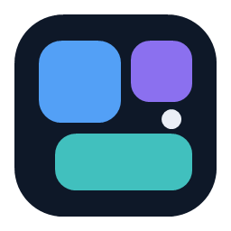
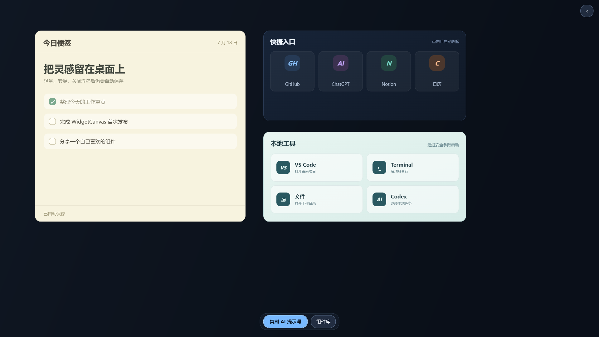

<div align="center">
  
  <h1>WidgetCanvas</h1>
  <p>Turn AI-generated HTML into live Windows desktop widgets.</p>
  <p><a href="README.zh-CN.md">简体中文</a> · <a href="docs/host-api.md">Host API</a> · <a href="CONTRIBUTING.md">Contributing</a></p>
</div>



WidgetCanvas is an AI-first desktop widget canvas for Windows. Describe a widget to any AI, paste the returned single-file HTML, and place it anywhere on a full-screen overlay. Widgets can store state, call HTTP APIs, read local files, use the clipboard, and launch local tools through a small host API.

## Why WidgetCanvas

- **AI-first workflow:** copy the built-in prompt, describe what you need, and paste one HTML file.
- **No custom widget language:** widgets are ordinary HTML, CSS, and JavaScript with visible source.
- **Desktop capabilities:** state, clipboard, HTTP, read-only files, known folders, and parameterized process execution.
- **Flexible placement:** drag, resize, lock, archive, search, or detach a widget into its own window.
- **Designed for long-running widgets:** hiding the canvas keeps active widgets running.
- **Local by default:** widget source and runtime state stay on your computer.

## Quick start

1. Download `WidgetCanvas-win-x64.zip` from [Releases](https://github.com/shuimowang/WidgetCanvas/releases).
2. Extract it and run `WidgetCanvas.exe`.
3. Click **复制 AI 提示词**, send it to any AI, and add your widget requirements.
4. Copy the returned complete HTML document.
5. Drag an empty area on the canvas. The editor reads the HTML from your clipboard automatically.

If the clipboard does not contain a complete HTML document, the editor starts with a ready-to-use note widget.

Windows 10/11 x64 is supported. WidgetCanvas is self-contained and does not require a separate .NET installation. It uses the [Microsoft Edge WebView2 Runtime](https://developer.microsoft.com/microsoft-edge/webview2/), which is included with current Windows installations.

## Everyday use

- Click outside all widgets or press `Esc` to hide the canvas without stopping widgets.
- Use the top-right `×` to actually exit and release WebView2 resources.
- Double-click the tray icon or run `WidgetCanvas.exe` again to reopen the canvas.
- Right-click the tray icon to open the canvas or component library, or launch any widget directly in its own window.
- Right-click a widget to edit, reload, lock, detach, archive, duplicate, or delete it.
- Hold `Ctrl` while dragging a widget handle to detach it into a standalone window.
- Use `WidgetCanvas.exe --widget "Widget title"` to open one widget directly by its HTML `<title>`.

## Data locations

User-authored widget source is easy to back up:

```text
Documents\浮岛\组件\widgets.json
```

Machine-local state is kept out of Documents and cloud sync:

```text
%LocalAppData%\浮岛\State\canvas.json
%LocalAppData%\浮岛\WebView2\
%LocalAppData%\浮岛\Logs\
```

Writes are debounced and atomic. The previous readable file is kept as a `.bak` backup.

## Widget host API

Widgets use `const host = window.widgetHost`. The API contains 23 Promise-based methods across state, clipboard, URLs, local paths, window control, HTTP, read-only files, and processes. See the complete [Host API reference](docs/host-api.md).

```html
<script>
const host = window.widgetHost;

async function load() {
  const count = await host.state.read("count", 0);
  await host.state.write("count", count + 1);

  const response = await host.http.get({ url: "https://example.com/data.json" });
  if (!response.ok || response.truncated) throw new Error(`HTTP ${response.status}`);
}

load().catch(error => {
  document.body.textContent = String(error?.message || error);
});
</script>
```

`process.start` and `process.run` are intentionally powerful. Review a widget's visible HTML source before running code from someone you do not trust. WidgetCanvas does not provide arbitrary file-write, delete, registry, or shell-string APIs, but the process methods can start any available executable, including command interpreters.

## Build from source

Requirements: Windows, .NET 10 SDK, and the WebView2 Runtime.

```powershell
dotnet restore WidgetCanvas.slnx
dotnet test tests\WidgetCanvas.Tests\WidgetCanvas.Tests.csproj -c Release
dotnet publish src\WidgetCanvas\WidgetCanvas.csproj -c Release -r win-x64 --self-contained true
```

The publish output is under `src\WidgetCanvas\bin\Release\net10.0-windows\win-x64\publish`.

## Status

WidgetCanvas is in early preview. The storage format may change before `v1.0`, but the widget-facing host API is kept deliberately small and documented.

## License

[MIT](LICENSE)
